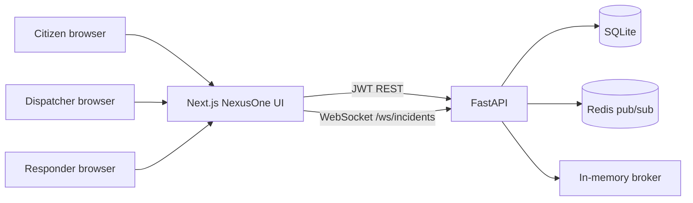

# NexusOne — Architecture

## Problem

City emergencies do not arrive as a single type. A flood needs buses and shelters. A fire needs an engine. A medical collapse needs an ambulance. A missing-person report needs people on foot. Those resources are owned by different desks, and the person answering the phone cannot see who is closest, who still has capacity, and who is already busy.

NexusOne is a **community coordination product**, not a public-safety answering point. The memorable capability is **DispatchRanker**: a deterministic 0–100 score that ranks which resource should respond, from distance, type affinity, spare capacity, and availability. Combined with a WebSocket incident board, a dispatcher can assign a unit while the rest of the room watches the same map.

**This is an educational simulation. It is not a 911 replacement.**

## Who uses it

| Role | Job to be done |
| --- | --- |
| `CITIZEN` | Register, report an incident, watch the public live board and map |
| `DISPATCHER` | Rank resources, assign a unit, watch status |
| `RESPONDER` | Accept an assignment, update en route / on scene / completed |
| `ADMIN` | Same as dispatcher plus resource catalog and seed oversight |

Self-registration always creates a `CITIZEN`. Other roles are seeded.

## System context

## Backend modules

| Module | Responsibility |
| --- | --- |
| `auth` | Register (citizen), login, JWT, role gates |
| `incidents` | CRUD-ish reports, filters, status |
| `resources` | Clinics, buses, shelters, volunteer teams, fire, ambulance |
| `assignments` | Dispatcher assigns; responder updates status |
| `dispatch_ranker` | Pure scoring — no I/O |
| `pubsub` | Redis when up, in-memory fallback when not |
| `realtime` | Local WebSocket hub |
| `worker` | Periodic DispatchRanker suggestions for unassigned OPEN incidents |
| `notify` | In-app alerts |
| `seed` | Kigali demo users, resources, incidents |

## Frontend map

| Route | Audience |
| --- | --- |
| `/login`, `/register` | Public |
| `/dashboard` | All authenticated — open / assigned / resolved |
| `/board` | Live WebSocket dispatch board |
| `/map` | Schematic Kigali pins |
| `/incidents`, `/incidents/new`, `/incidents/[id]` | Report and detail / assign |
| `/resources` | Dispatcher, admin, responder |
| `/notifications` | All authenticated |

## Authentication and authorization

- Passwords hashed with passlib bcrypt (72-byte truncation).
- Access JWT (HMAC via python-jose) in `Authorization: Bearer`. WebSockets pass the same token as `?token=`.
- Role checks on write endpoints. Citizens may cancel their own OPEN reports only.
- CORS restricted to `CORS_ORIGINS` (default `http://localhost:3005`).
- Validation on every write schema (Pydantic).

## Real-time path

1. A REST write (new incident, assignment, status) publishes a JSON event on channel `nexusone.incidents`.
2. If Redis is reachable, that is a Redis `PUBLISH`. If it is not, an in-memory asyncio queue is used.
3. One process-level pump subscribes and fans out to local WebSocket clients via `ConnectionHub`.
4. Connecting clients receive a `board.snapshot` of currently live incidents, then incremental events.

REST **does not** require Redis. A single-process demo therefore still has a live board. Multiple API replicas need Redis so events cross process boundaries. That trade-off is documented here because it is the reason the fallback exists.

## DispatchRanker

Scoring is bounded 0–100:

| Signal | Max | Rule |
| --- | --- | --- |
| Type affinity | 40 | FIRE→fire unit, MEDICAL→ambulance/clinic, FLOOD→shelter/bus, MISSING_PERSON→volunteers |
| Distance | 35 | Haversine; 0 km = 35, ≥15 km = 0 |
| Spare capacity | 15 | `(capacity - load) / capacity` |
| Availability | 10 | AVAILABLE = 10; BUSY = 0 and a −15 penalty; OFFLINE = ineligible, score 0 |

CRITICAL incidents get a small boost when a unit is nearby. The ranker is a pure dataclass pipeline so pytest can pin behaviour without FastAPI or Redis.

## Persistence

SQLite file `./data/nexusone.db` for local and Compose. Tables are created with SQLAlchemy `create_all` on startup. That is an explicit demo trade-off — production should use PostgreSQL and Alembic migrations (see [deployment.md](./deployment.md)).

## Background worker

An in-process asyncio loop (not a separate Celery worker) publishes `dispatch.suggestion` events for OPEN incidents that still have no active assignment. It exists to show how ranking can run off the request path. A production deployment would extract it to its own process.

## What we did not build

- No Google Maps key, no Mapbox token — the UI projects WGS84 onto a CSS/SVG schematic of Kigali.
- No real telephony, radio, or CAD integration.
- No claim that this system is suitable for life-safety dispatch.
