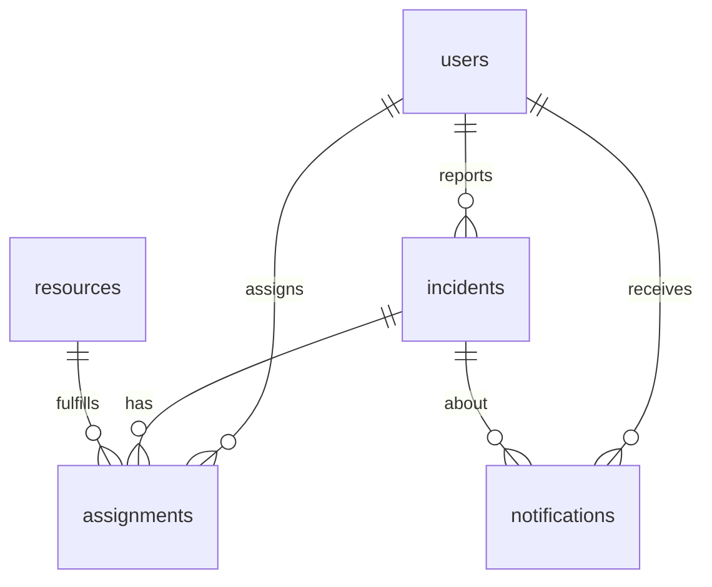

# NexusOne — Database

Local engine: **SQLite** at `./data/nexusone.db` (`DATABASE_URL=sqlite:///./data/nexusone.db`). Foreign keys are enabled with `PRAGMA foreign_keys=ON`. SQLAlchemy 2 mapped columns create the schema on startup.

This is a demo schema. Production should move to PostgreSQL with migrations.

## Tables

### `users`

| Column | Type | Notes |
| --- | --- | --- |
| id | integer PK | |
| email | string unique | Lowercased |
| hashed_password | string | bcrypt |
| full_name | string | |
| phone | string nullable | |
| role | enum | `CITIZEN`, `DISPATCHER`, `RESPONDER`, `ADMIN` |
| is_active | boolean | |
| created_at | timestamptz | |

### `incidents`

| Column | Type | Notes |
| --- | --- | --- |
| id | integer PK | |
| title, description | string/text | |
| incident_type | enum | `FLOOD`, `MEDICAL`, `FIRE`, `MISSING_PERSON` |
| status | enum | `OPEN`, `ASSIGNED`, `EN_ROUTE`, `ON_SCENE`, `RESOLVED`, `CANCELLED` |
| severity | enum | `LOW`, `MEDIUM`, `HIGH`, `CRITICAL` |
| latitude, longitude | float | WGS84 |
| location_name | string | Human label (Nyabugogo, Kimironko, …) |
| reporter_id | FK users | |
| created_at, updated_at, resolved_at | timestamptz | |

Indexes on type, status, severity, created_at.

### `resources`

| Column | Type | Notes |
| --- | --- | --- |
| id | integer PK | |
| name | string | |
| resource_type | enum | `CLINIC`, `BUS`, `SHELTER`, `VOLUNTEER_TEAM`, `FIRE_UNIT`, `AMBULANCE` |
| capacity, current_load | integer | Load is incremented on assign |
| latitude, longitude | float | |
| location_name | string | |
| status | enum | `AVAILABLE`, `BUSY`, `OFFLINE` |
| contact_phone, notes | string | Simulation contacts only |

### `assignments`

| Column | Type | Notes |
| --- | --- | --- |
| id | integer PK | |
| incident_id | FK incidents | |
| resource_id | FK resources | |
| assigned_by_id | FK users | Dispatcher |
| responder_id | FK users nullable | |
| status | enum | `PENDING`, `ACCEPTED`, `EN_ROUTE`, `ON_SCENE`, `COMPLETED`, `DECLINED` |
| notes | text | |
| ranker_score | float | Snapshot of DispatchRanker at assign time |
| ranker_reason | string | Human-readable reasons |
| assigned_at, updated_at | timestamptz | |

### `notifications`

| Column | Type | Notes |
| --- | --- | --- |
| id | integer PK | |
| user_id | FK users | |
| title, body | string/text | |
| read | boolean | |
| incident_id | FK incidents nullable | |
| created_at | timestamptz | |

## Entity relationship

## Seed (Kigali)

Users: `citizen@`, `dispatcher@`, `responder@`, `admin@` all `@nexusone.local`.

Resources sit on real-ish landmarks: CHUK, King Faisal / Kacyiru, Nyabugogo bus park, Amahoro Stadium, Kimironko, Nyamirambo, Gikondo, Kanombe, Kicukiro. Coordinates cluster around `-1.95, 30.06`.

Open incidents include a Nyabugogo flood, a Nyamirambo fire, and a Kimironko missing-person report. A CHUK-gate medical incident is pre-assigned so the board is not empty of motion.
